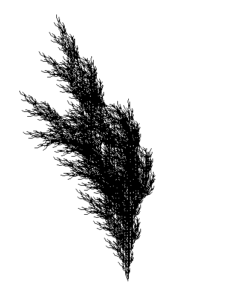
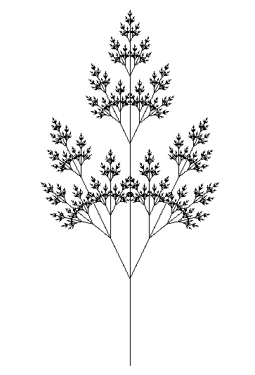
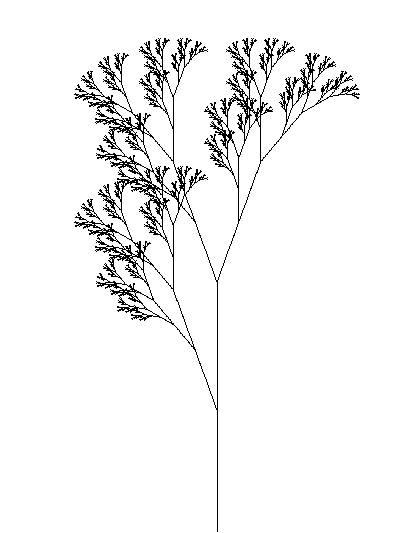
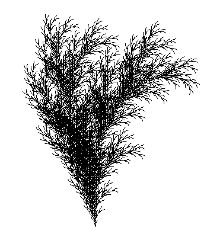

# L-System Generator

This program is a flexible implementation of a Lindenmayer System for generating fractal patterns, with a specific focus on tree-like structures. Although it's tailored to simulate natural arboreal forms, it can be adapted to create a wide range of fractal shapes. 

<p align="center">
  
</p>

## About the Project

The fascination with fractals' infinite complexity and their potential to mimic natural forms drove the development of this program. Starting from simple rules, the system recursively applies transformations to evolve complex tree-like structures or other fractal patterns, mimicking the natural growth patterns of plants and trees.

### Built With

The project utilizes Python and leverages the Pygame library for graphical output, making it easy to run and accessible on any system with Python support.

- 
- 

## Getting Started

### Prerequisites

Ensure you have Python and Pygame installed on your machine. Python can be installed from [python.org](https://python.org), and Pygame can be installed using pip:

```bash
pip install pygame
```

## Installation

```sh
git clone https://github.com/Mixnikon108/L-System.git
```

Navigate to the project directory:

```sh
cd L-System
```

## Usage

To run the program, execute the following command in the project directory:

```sh
python LSystem.py
```

This will open a window displaying the fractal tree. Parameters to modify are in the `LSystem.py` file. You can change `axiom`,`rules`, `iterations`,`angle` and `l_system.calculate_points(units= <CHANGE_THIS_FOR_LENGTH>)`.

## Gallery
Here are some examples of fractal trees generated by this tool. Some of the examples has been taken from [Daniel John Jones](https://www.danieljohnjones.com/projects/l-systems/) website:

<p align="center">
  <table>
    <tr>
      <th style="text-align: center;">Regla</th>
      <th style="text-align: center;">Imagen</th>
    </tr>
    <tr>
      <td style="text-align: center;">F[++F[-F]]F[-FF[F]]</td>
      <td style="text-align: center;"></td>
    </tr>
    <tr>
      <td style="text-align: center;">F[++F[-F]]F[-FF[F]]</td>
      <td style="text-align: center;"></td>
    </tr>
    <tr>
      <td style="text-align: center;">F[++F[-F]]F[-FF[F]]</td>
      <td style="text-align: center;"></td>
    </tr>
    <tr>
      <td style="text-align: center;">F[++F[-F]]F[-FF[F]]</td>
      <td style="text-align: center;"></td>
    </tr>
  </table>
</p>


## Contact
Jorge de la Rosa - [@mixnikon](https://twitter.com/mixnikon)
Project Link: [https://github.com/Mixnikon108/L-System.git](https://github.com/Mixnikon108/L-System.git)

